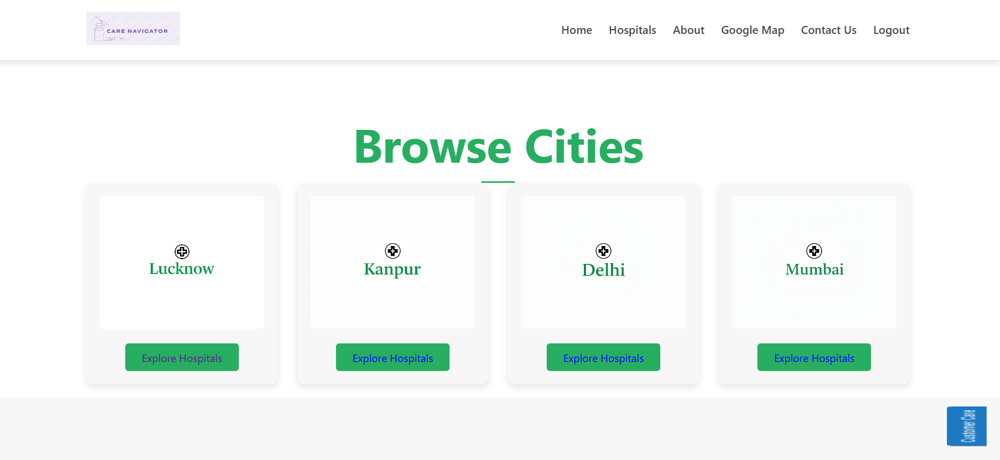
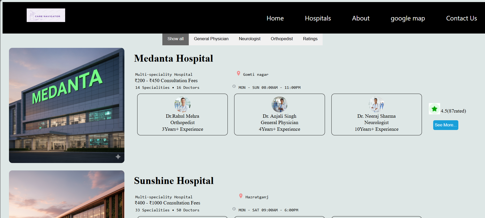
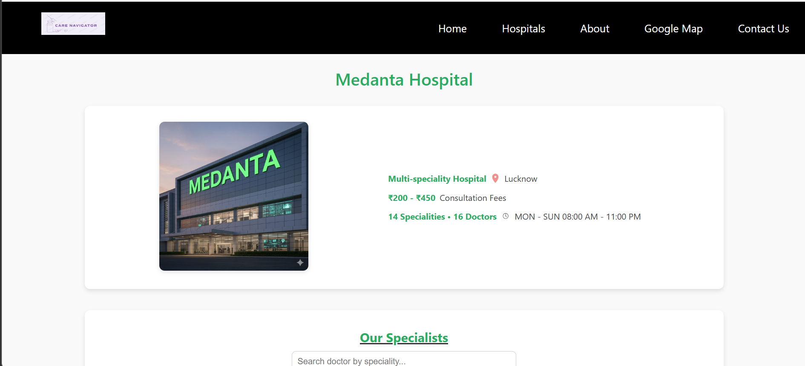
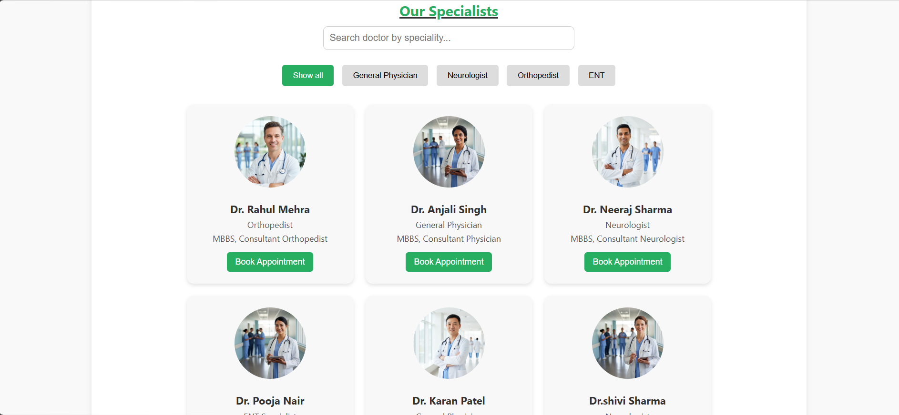
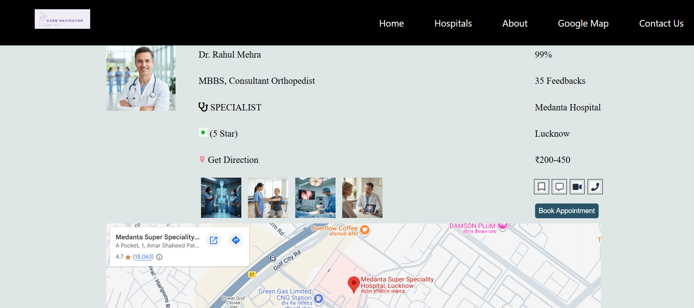
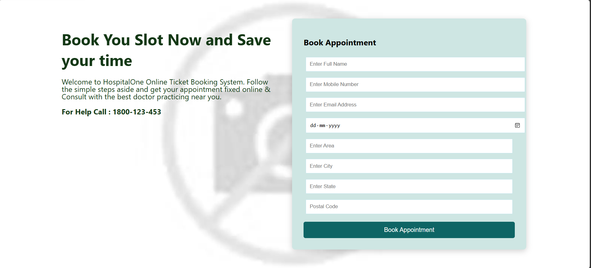
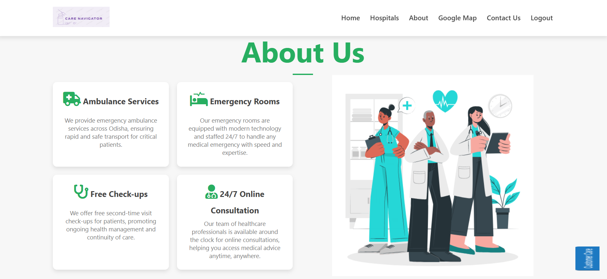
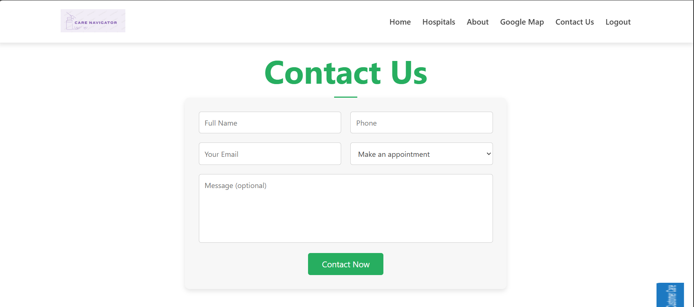

# Care Navigator — Smart Hospital Finder & Appointment Booking Platform

<p align="center">


</p>

A modern **healthcare discovery platform** that helps users **find nearby hospitals, explore doctors, view specialties and fees, check hospital locations on maps, and book appointments online.**

Designed and developed by **Upendra Singh**.

---

# Overview:

**Care Navigator** is a web-based platform designed to make **healthcare discovery easier and faster**.

Users can:

* Search for hospitals by city
* Explore available doctors
* Check doctor specialties and consultation fees
* View hospital locations on maps
* Book appointments easily

The interface focuses on **simplicity, accessibility, and user-friendly navigation**, helping patients quickly find the healthcare services they need.

---

# Features:

## Hospital Discovery-

* Browse hospitals by city
* View hospital details and services
* Explore hospitals available in different locations

## Doctor Information-

* View available doctors
* Check doctor specialties
* View consultation fees
* Doctor experience and details

## Appointment Booking-

* Book doctor appointments easily
* View available doctors in a hospital
* Simple appointment workflow

## Location Integration-

* View hospital location on maps
* Easily navigate to hospitals

## Modern UI Design-

* Clean and responsive interface
* Mobile-friendly layout
* Smooth navigation across pages

---

# Tech Stack:

| Layer       | Technologies          |
| ----------- | --------------------- |
|  Frontend   | HTML, CSS, JavaScript |
|  Maps       | Google Maps API       |
|  Tools      | Git, GitHub, VS Code  |

---


# Project Preview:

## Home Page-

<p align="center">

</p>

---

## Browse Cities-

<p align="center">

</p>

---

## Hospitals List-

<p align="center">

</p>

---

## Particular Hospital-

<p align="center">

</p>

---

## Doctors List-

<p align="center">

</p>

---

## Particular Doctor-

<p align="center">

</p>

---

## Appointment Booking-

<p align="center">

</p>

---

## About Us-

<p align="center">

</p>

---


## Contact Us-

<p align="center">

</p>

---

# Installation & Setup:

## Clone Repository-

```bash id="carecmd1"
git clone https://github.com/Upendra2313845/carenavigator.git
```

## Move to Project Folder-

```bash id="carecmd2"
cd carenavigator
```

## Run the Project-

Open the following file in your browser:

```
index.html
```

---

# Future Improvements-

* User authentication system
* Real-time appointment availability
* Doctor rating and review system
* AI-based hospital recommendation
* Emergency ambulance booking
* Online consultation support

---

# Live Demo:

The project is currently not hosted online.

You can run the project locally by following the installation steps above.

A live demo will be added soon.


---

# About the Developer:

Hi! I'm **Upendra Singh** 

🎓 B.Tech Computer Science Engineering
Pranveer Singh Institute of Technology, Kanpur, Uttar pradesh 

I am passionate about:

* Web development
* UI design
* Building useful real-world projects
* Competitive programming

---

# Skills:

Frontend
HTML • CSS • JavaScript

Tools
Git • GitHub • VS Code

Interests
Full Stack Development • UI Design • Problem Solving

---

### Connect with Me:
[](https://github.com/Upendra2313845)
[](https://linkedin.com)
[](mailto:upendra@example.com)

⭐ If you like this project, please give it a **star on GitHub!**
